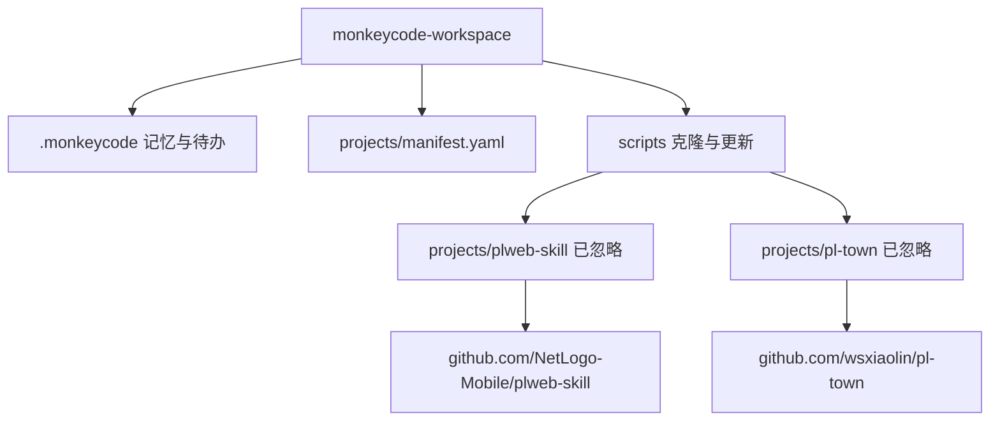

# 架构设计

## 系统概述

工作台是一层薄编排：Git 仓库只保存文档和脚本；真实项目以独立 Git 仓库存在，克隆到被忽略的 `projects/<name>/`。

## 技术栈

- Git：工作台与各业务仓库分离
- YAML 清单：项目登记
- Bash + Python 标准库：解析清单并 clone/pull

## 项目结构（建议）

见仓库根目录 `WORKSPACE.md` 第 2 节。

## 核心模块/组件

| 模块 | 职责 |
|------|------|
| `.monkeycode/` | 记忆、文档、待办、规格 |
| `projects/manifest.yaml` | 可提交的项目登记 |
| `projects/<name>/` | 不可提交的源码检出 |
| `scripts/` | 按清单克隆和更新 |

## 关键流程

1. 在 manifest 追加项目
2. 运行 `bootstrap-projects.sh`
3. 在 `projects/<name>/` 内用该项目自己的 Git 开发
4. 跨项目知识写回 `.monkeycode/MEMORY.md`

## 设计决策

- 使用 gitignore 而不是 submodule：用户明确要求项目本身不由本仓库维护，且这两个仓库必须被 ignore
- 清单可提交、源码不可提交：新环境只需 clone 工作台再跑 bootstrap
- 依赖留在各项目目录：避免把无关 lockfile 提升到工作台根
